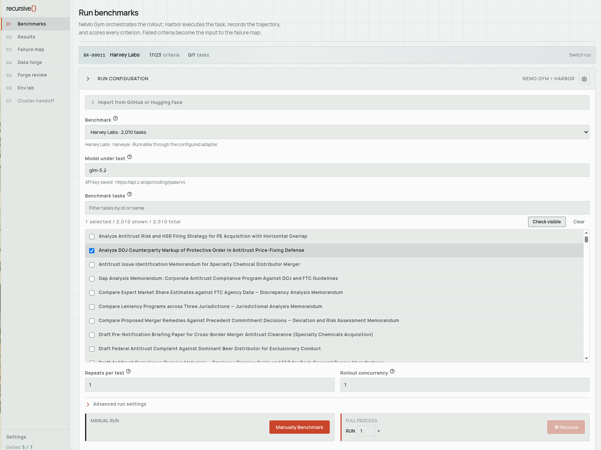
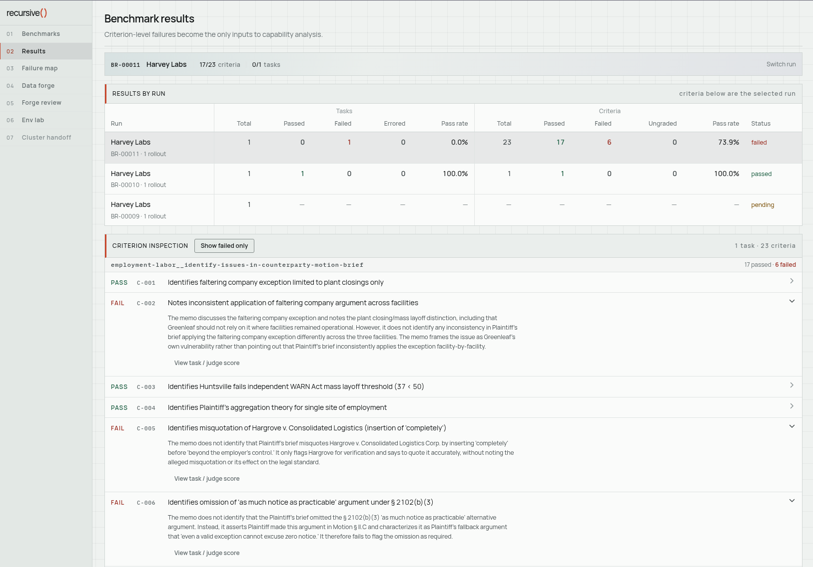
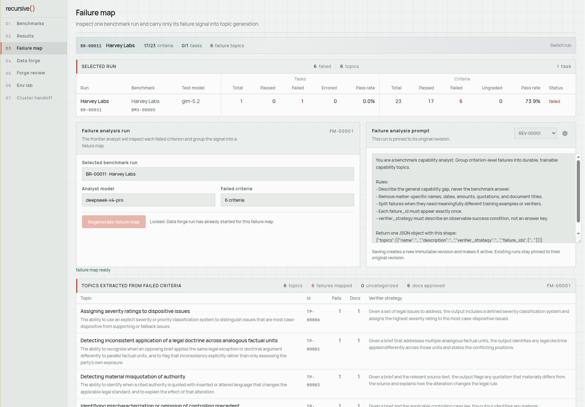
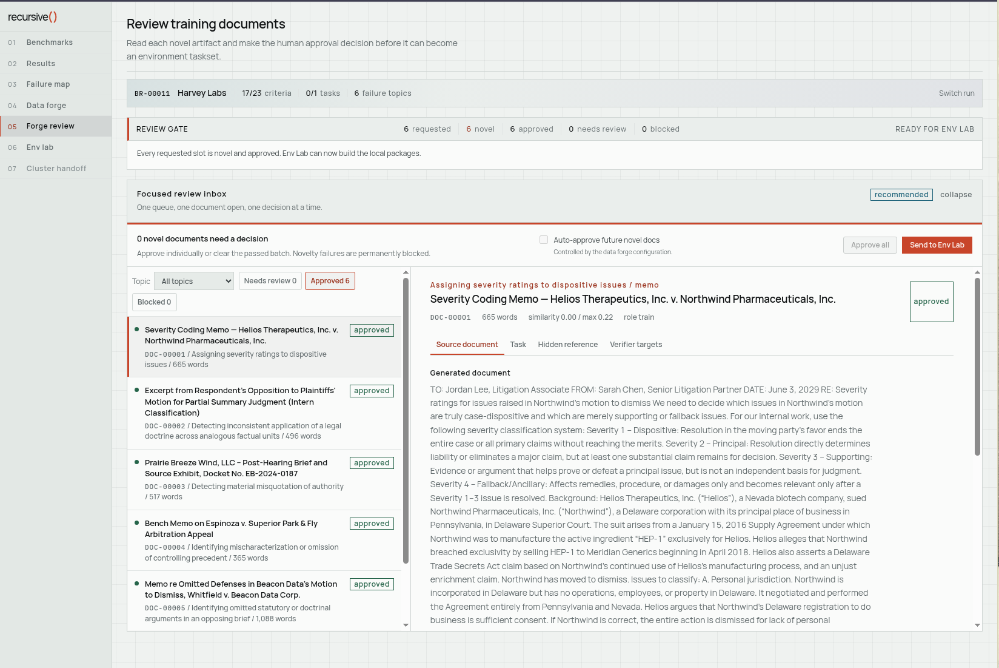
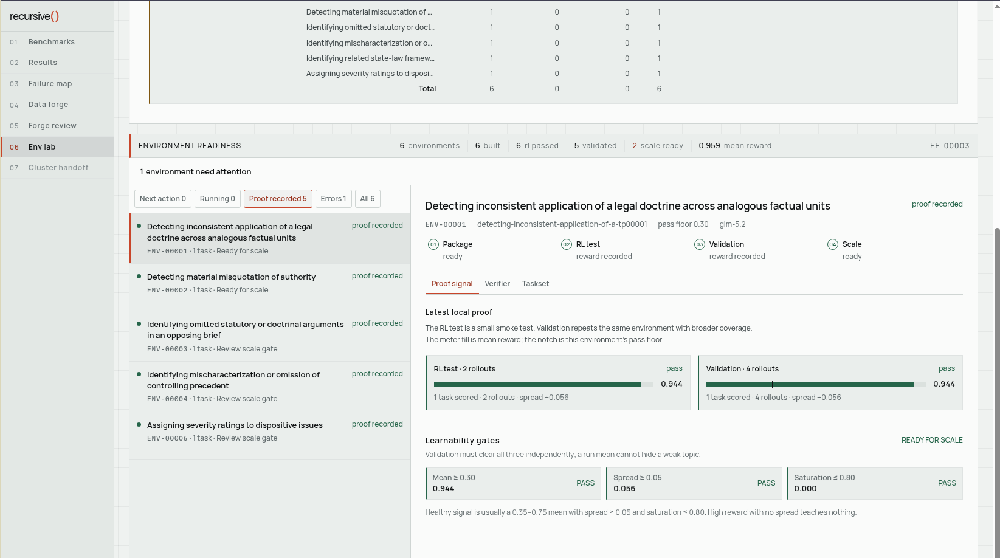

# Recursive Lab

Contains the Harbor framework, NeMo Gym, and NVIDIA Data Designer.

Workflow: run a Harbor benchmark → categorize failures and write verifiers for those topics → create synthetic data → build and test the RL environment locally → push to the cluster.

