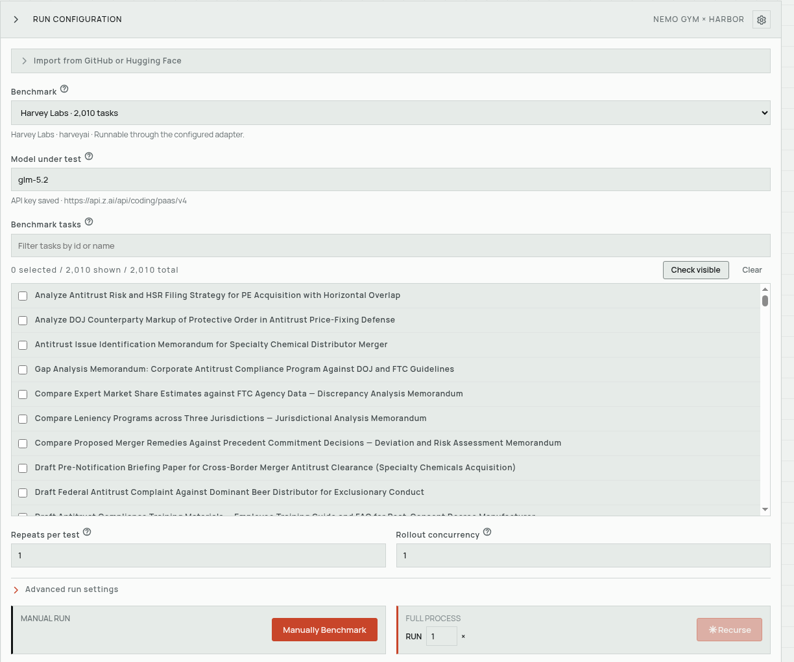
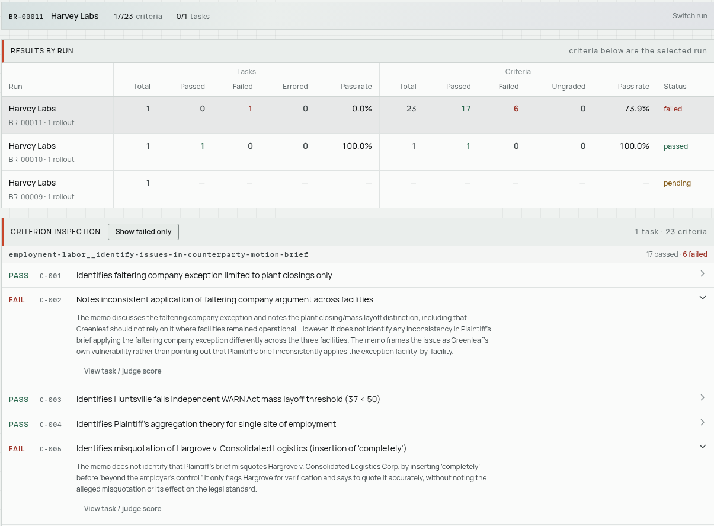
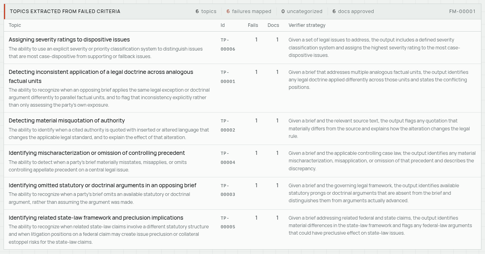
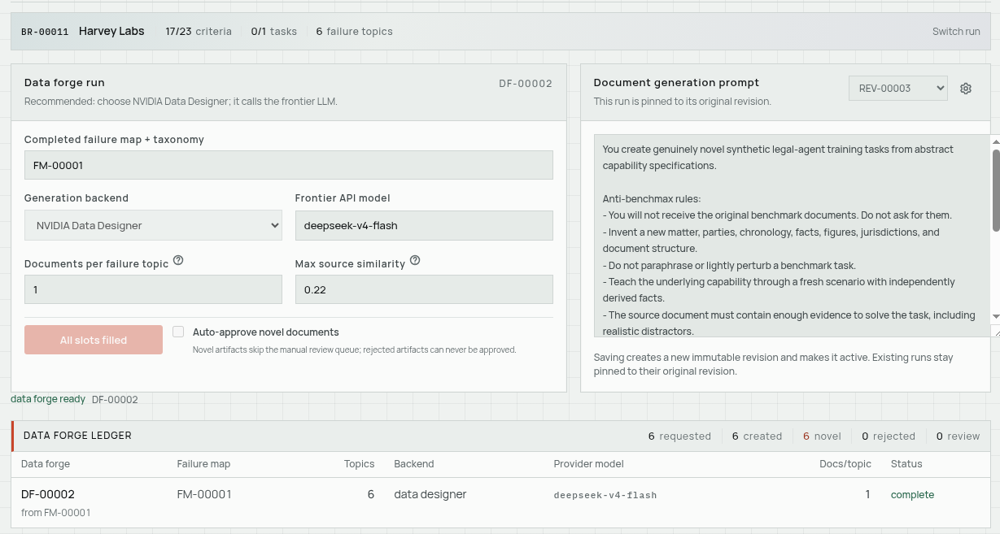
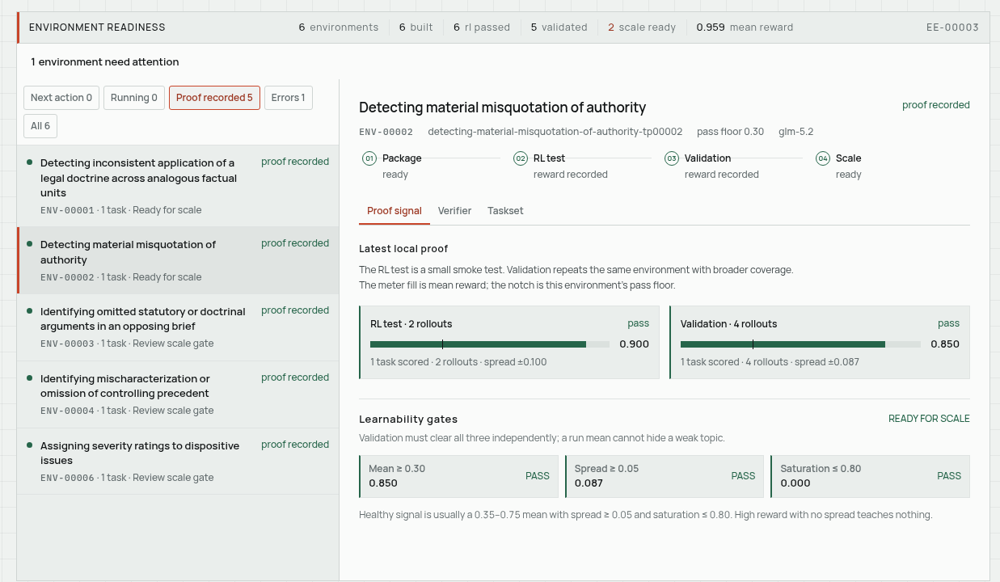

# Recursive Lab

Contains the Harbor framework, NeMo Gym, and NVIDIA Data Designer.

Workflow: run a Harbor benchmark → categorize failures and write verifiers for those topics → create synthetic data → build and test the RL environment locally → push to the cluster.

## Run locally

```sh
bun install
cp .env.example .env
bun run dev
```

NeMo Gym needs to be prepared and running for benchmark work. If it does not start with the app, start it from a second terminal:

```sh
(cd gym && .venv/bin/gym env start --resources-server legal_agent_bench --model-type inference_provider)
```

Open `http://127.0.0.1:8767`, then configure **Settings**. Keys are stored in the Gym checkout's gitignored `env.yaml` and are never returned to the browser.

| Setting | Used for |
| --- | --- |
| Model under test | Policy rollouts for the model being evaluated. |
| Benchmark judge | Scoring verifier criteria during Env Lab evaluation. |
| Failure analyst | Turning failed criteria into failure-map topics. |
| Synthetic generation | Creating novel training documents through Data Designer or a frontier model. |
| Prime Intellect | Optional publishing and cluster dispatch. |










